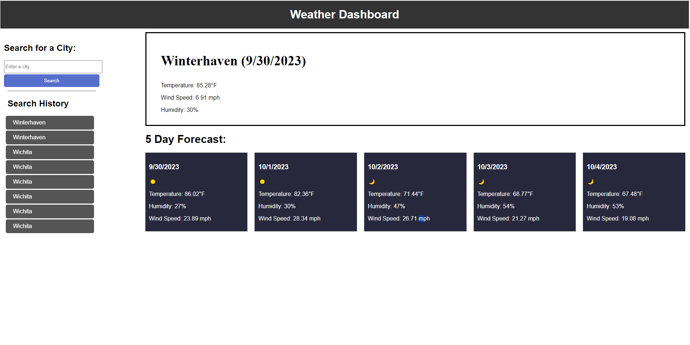

# Weather Tracker
Utilizing API's to create a weather forecast for a desired locaiton

## Features
- Search for Cities: Users can search for cities to view their current and 5-day forecast weather conditions.
- Current Weather: Displays the city name, date, weather icon, temperature (in Fahrenheit), humidity, and wind speed for the current weather conditions.

- 5-Day Forecast: Shows a 5-day forecast that includes the date, weather icon, temperature (in Fahrenheit), humidity, and wind speed for each day.

- Search History: Keeps a history of the searched cities, allowing users to click on a city in the search history to view its weather conditions again.

- Persistent Data: Uses localStorage to store search history data, ensuring that previous searches are retained even after refreshing the page.

## Usage
1 Search for a City:
 - Enter the name of a city in the input field.
 - Click the "Search" button or press Enter.

2. View Current Weather:
 - After searching for a city, the current weather conditions for that city will be displayed, including temperature, humidity, and wind speed.

3. View 5-Day Forecast:
 - Below the current weather, you'll find a 5-day forecast that provides weather information for each day.
4. Search History:
 - The search history appears on the left side of the page, allowing you to click on a previously searched city to view its weather conditions again.

 ## Technologies Used
 - HTML
 - CSS
 - JavaScript
 - OpenWeatherMap API

## Deployed link
https://justfog36.github.io/weatherTracker/ 

 ## Deployed Page
 